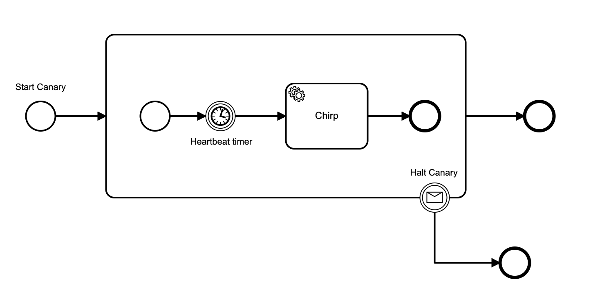

# Zeebe Cloud Canary

Use this package to allow your Zeebe applications to alert when they are not able to receive work from the broker - whether due to a broker outage or a dropped connection.

The `ZeebeCanary` class deploys a workflow to the broker that starts a loop with a user-configured heartbeat interval, and spawns a worker that services the loop. 

Whenever the canary worker services the loop task, it pings the "chirp" url. 

If the canary does not get a chirp task in 1.5x the heartbeat interval, it can ping a "squawk" url.

The worker starts the next loop iteration as a new workflow instance, so that you are not running a non-reapable long-running process (that would mess with your snapshot size on disk and recovery time).



The canary uses micromustache to template the `ZeebeCanary.CanaryId` into the workflow before it is deployed, to allow you to have canaries for multiple applications / instances running on the same broker.

## Installation

```bash
npm i zeebe-cloud-canary
```

## Use

If you use an external healthcheck ping like [healthchecks.io](healthchecks.io) for the `ChirpUrl`, it will squawk if the canary does not chirp on time, _and_ if the canary process dies, so it will also alert you on client application failure.

You can use your own `SquawkUrl`, and it will be pinged if the canary does not get a chirp task in 1.5x the heartbeat interval - but not if the canary process itself (your application) dies.

```typescript
import { ZeebeCanary } from 'zeebe-cloud-canary';

// Uses the zeebe-node zero-conf constructor, either localhost or from ENV
const canary = new ZeebeCanary({
    ChirpUrl: `${healthchecks_io_url},
    CanaryId: 'some-application-id',
    HeartbeatPeriodSeconds: 300
})
```

You can pass in the ZBClient constructor options explicitly, like this:

```typescript
import { ZeebeCanary } from 'zeebe-cloud-canary';

// Uses an explicit ZBClient constructor for configuration
const canary = new ZeebeCanary({
    ChirpUrl: '',
    CanaryId: 'some-application-id',
    HeartbeatPeriodSeconds: 300,
    ZBConfig: {
        hostname: `${zeebe_address}:${optional_port}`,
        longPoll: 55000
    }
})
```


